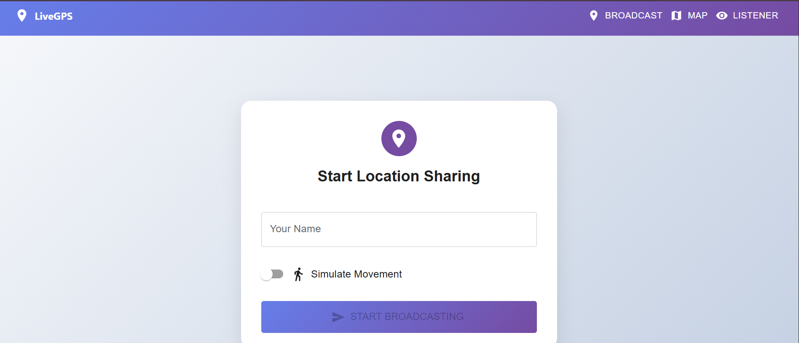
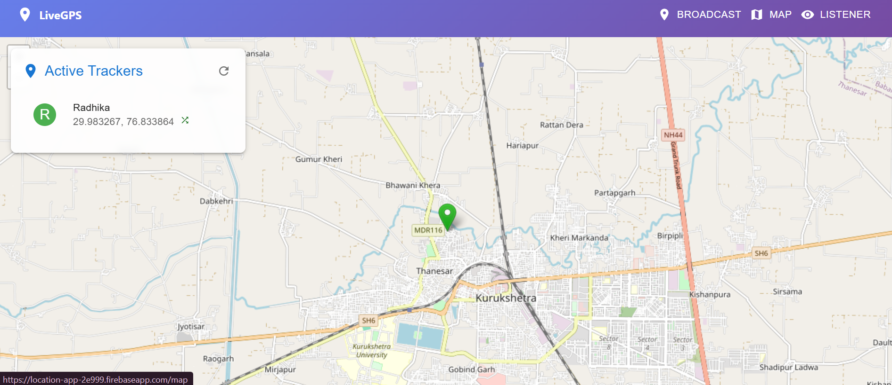
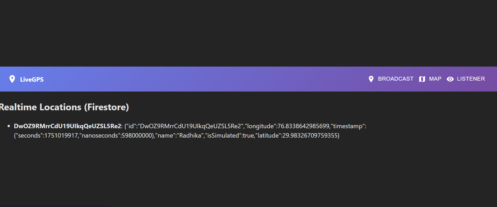

# 📍 Live Location Tracker

A real-time multi-user location tracking web application built using **React**, **Firebase**, and **React-Leaflet** (OpenStreetMap).  
🌐 **No billing required** — works completely free without Google Maps API.

---

## 🚀 Features

- 🔐 Anonymous Firebase Authentication
- 📡 Real-time Firestore location updates
- 🗺️ Interactive map using OpenStreetMap (via Leaflet)
- 👥 Multiple users can broadcast their location
- 🎯 Map auto-centering based on active users
- 💻 Ready for Firebase Hosting deployment
- 💸 **No Google Maps API or billing required**

---

## 🧩 Tech Stack

| Technology | Purpose |
|------------|---------|
| React | Frontend framework  
| Firebase | Backend (Auth + Firestore + Hosting)  
| React-Leaflet | Free interactive maps  
| OpenStreetMap | Map tiles (no API key needed)  
| Material UI | UI components  

---

## 🔐 Firebase Setup

1. Go to [Firebase Console](https://console.firebase.google.com/)
2. Create a new project
3. Enable:
   - **Authentication** → Anonymous
   - **Cloud Firestore** → Start in test mode
4. Register a web app and copy the Firebase config

---

## 🔧 .env File Setup

Create a `.env` file in the root of your project and add the following:

```env
REACT_APP_FIREBASE_API_KEY=your_firebase_api_key
REACT_APP_FIREBASE_AUTH_DOMAIN=your_project.firebaseapp.com
REACT_APP_FIREBASE_PROJECT_ID=your_project_id
REACT_APP_FIREBASE_STORAGE_BUCKET=your_project.appspot.com
REACT_APP_FIREBASE_MESSAGING_SENDER_ID=your_sender_id
REACT_APP_FIREBASE_APP_ID=your_app_id
```

---

## 📦 Install Dependencies
npm install
npm install react-leaflet leaflet

Also add Leaflet CSS in index.js or App.js:
import 'leaflet/dist/leaflet.css';

---

💻 Run the App Locally
npm start

Then open: http://localhost:3000

---

🗺️ Map Source
Map rendered using React-Leaflet

Tiles served from OpenStreetMap

---

🚀 Deploy to Firebase
npm run build
firebase init
firebase deploy

---

## 📸 Screenshots

### 👥 Active Broadcast Panel  
 

### 🗺️ Live Map View  


### 🔄 Real-time Listener Tracking  


---

## 🔗 Live Demo

👉 [Click here to view the live app](https://your-project-name.web.app)

_(Hosted on Firebase)_


---

🙋‍♀️ Created with ❤️ by Radhika
